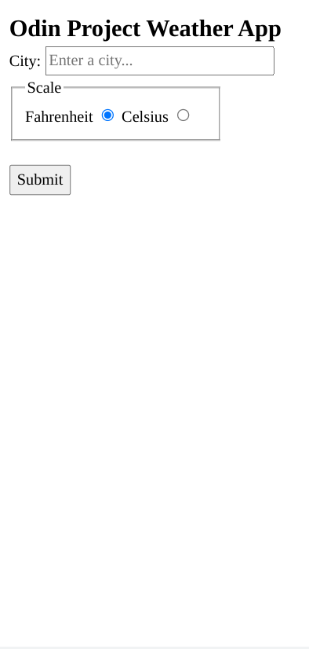
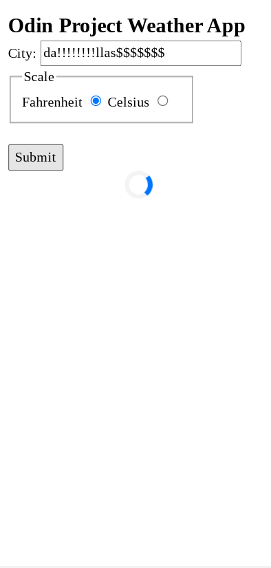
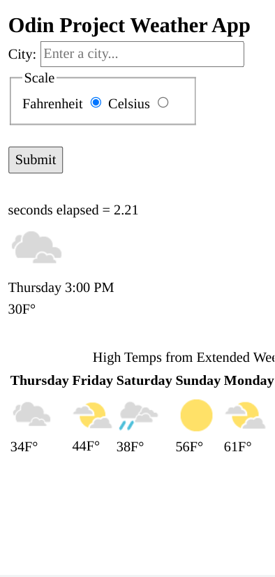
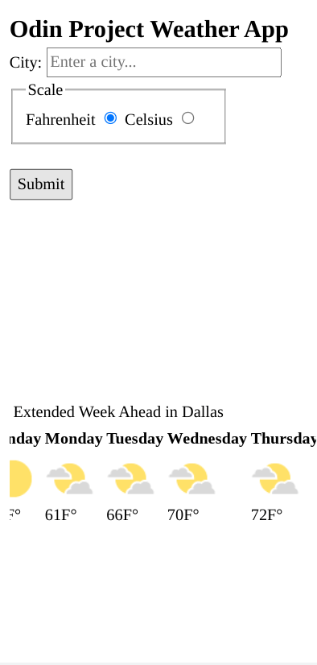
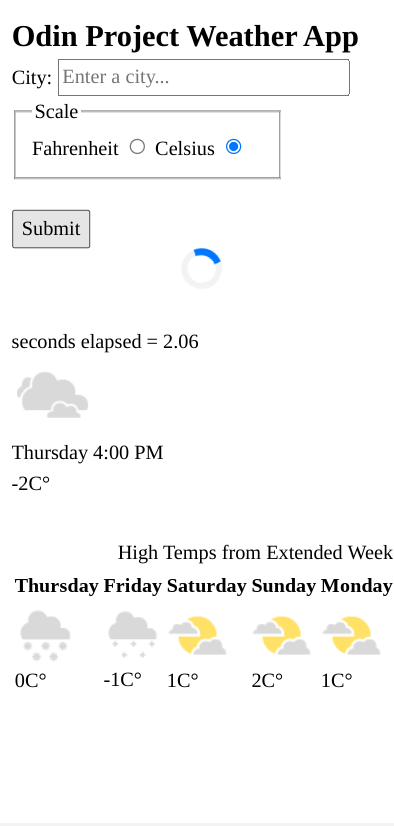

<h1 align="center">Weather App</h1>

   Solution for a challenge from  <a href="https://www.theodinproject.com/paths/full-stack-javascript/courses/javascript/lessons/weather-app" target="_blank">theodinproject.com</a>.

## Table of Contents

- [Overview](#overview)
  - [Built With](#built-with)
  - [Thoughts](#thoughts)
- [Features](#features)
- [Improvements](#improvements)
- [Useful Resources](#useful-resources)

## Overview

### Built With

- HTML
- CSS
- JS

### Thoughts

Found a weather api that doesn't require an api key.  The api seems to search google for your location's weather and scrap the data.  
Had issues with cors and rather than use 'no-cors' - I found about justcors service which allows you proxy the api request.  
Downside - to prevent abuse and lower their costs, the proxy api changes daily but you can get permanent proxy with email address. 

I also looked into creating my own proxy server in Express and the linked medium article describes the process.  Essentially you create a middleware function that adds the header to the fetch request.   

The javascript is messy and makes you appreciate frameworks. 

Regarding accessibility -  having weeks data presented in a table may be not preferrable.  Also, alt tags can overlap but can't really be avoided.

Throttling the click event can conflict with e.preventDefault().

## Features

The [challenge](https://www.theodinproject.com/paths/full-stack-javascript/courses/javascript/lessons/weather-app) was to create a weather forecast site using the weather API. You should be able to search for a specific location and toggle displaying the data in Fahrenheit or Celsius.

## Improvements

- Accessibility
- Improve JS
- Styling 

### Resources

- [WeatherDB](https://weatherdbi.herokuapp.com/documentation/v1)
- [JSON Formatter](https://jsonformatter.curiousconcept.com)
- [Unicode](https://unicode-table.com/en/00B0/) - Degree unicode
- [Medium](https://medium.com/@dtkatz/3-ways-to-fix-the-cors-error-and-how-access-control-allow-origin-works-d97d55946d9) - CORS
- [Just CORS](https://justcors.com/) - CORS proxy
- [Stack Overflow](https://stackoverflow.com/questions/3547035/getting-html-form-values) - getting form values
- [Stack Overflow](https://stackoverflow.com/questions/4374822/remove-all-special-characters-with-regexp) - remove special characters regex
- [YouTube](https://www.youtube.com/watch?v=qBg8IB3u28s) - populate table 
- [Stack Overflow](https://stackoverflow.com/questions/49197622/how-to-use-an-entity-with-textcontent) - entity with textcontent
- [Dev.to](https://dev.to/ibn_abubakre/append-vs-appendchild-a4m) - append vs appendChild
- [MDN Docs](https://developer.mozilla.org/en-US/docs/Web/API/HTMLTableElement/createCaption) - createCaption
- [Javascript Tutorial](https://www.javascripttutorial.net/dom/manipulating/remove-all-child-nodes/) - remove all child nodes
- [Stack Overflow](https://stackoverflow.com/questions/14360581/force-landscape-orientation-mode) - force landscape orientation mode
- [Stack Overflow](https://stackoverflow.com/questions/53799108/how-to-add-a-loading-animation-while-fetch-data-from-api-vanilla-js) - loading animation vanilla js
- [MDN Docs](https://developer.mozilla.org/en-US/docs/Web/JavaScript/Reference/Global_Objects/Date/now) - Date.now()
- [Dev.to](https://dev.to/vaishnavs/displaying-loading-animation-on-fetch-api-calls-1e5m) - loading animation on fetch request
- [Dockyard](https://dockyard.com/blog/2020/03/02/accessible-loading-indicatorswith-no-extra-elements) - accessible loading indicators
- [SwitchGeek](https://switchgeek.com/3-ways-download-favicon-website/) - favicon
- [Codepen](https://codepen.io/stevef/pen/OZwMqv/) - aria-busy test
- [FreeCodeCamp](https://www.freecodecamp.org/news/javascript-debounce-example/) - debounce
- [Dev.to](https://dev.to/otamnitram/throttling-and-debouncing-avoiding-unnecessary-api-calls-2god) - throttling and debouncing